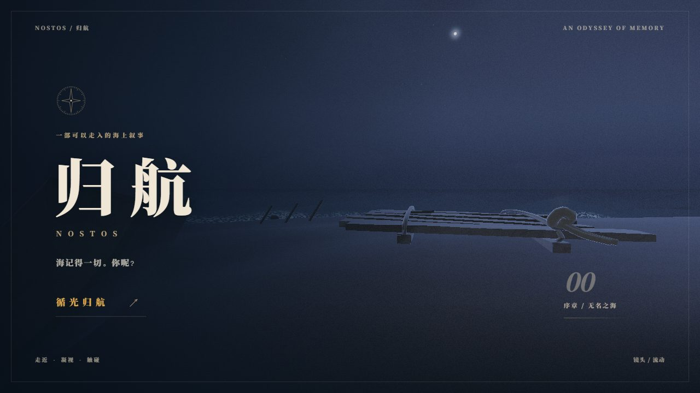

# 归航 · NOSTOS

> 一个远航者，和他回家路上的每一次停靠。

**本仓库当前交付的是《归航 · NOSTOS》**：以《奥德赛》为背景的第一人称步行叙事探索游戏。玩家在八座彼此独立的小岛上行走、观察、触碰遗物，逐步拾回归乡的记忆。

没有战斗、背包或开放世界。核心只有三个动词：**走、看、触碰**。



## 本地运行

在仓库根目录安装依赖。CI 使用 Node.js 22；运行游戏需要支持 WebGL2 的浏览器。

```bash
npm ci
npm run dev:nostos
```

打开 [本地游戏](http://127.0.0.1:4175/)，点击「循光归航」。操作：

- WASD / 方向键：移动；Shift：快跑。
- 鼠标：观察；E / Enter / 鼠标左键：触碰。
- H：呼唤短暂的引路光尘。
- 空格：推进旁白、跳过开场或回忆；Esc：暂停与设置。

**请使用 `dev:nostos`。** 根目录的 `npm run dev` 仍是历史框架参考页，不是当前交付的游戏。

### 分幕美术预览

- [第一幕 · 忘食岸](http://127.0.0.1:4175/?preview=lotus)
- [第二幕 · 独眼岬](http://127.0.0.1:4175/?preview=cyclops)

这两个入口仅在本机启用，直接进入相应场景，**不会读取、覆盖或清除正常存档**。需要固定端口时可直接运行：

```bash
npx vite --config games/nostos/vite.config.ts --host 127.0.0.1 --port 4175 --strictPort
```

## 当前交付进展

截至 2026-09-05：

- 八幕叙事流程已实现：开始、登岸、漫游、线索、回忆、离岛、暂停与终幕。
- 第0幕完成盐蚀木筏、绳结、断桨、湿岸和导星试点；已修复试水温的 E 反馈。
- 开场改为实时海岸标题与约15秒连续镜头，加入情境引导、键盘焦点、窄屏布局和低动态模式。
- 第1、2幕深化果树庭院、陶器、灰塘、弃置头盔、层岩洞窟与烧尖木桩，并同步交互落点和通行验证。
- 第一幕「留下的人」已改为程序化3D跪坐水手；独眼回忆拆成四段小剧场，分区构图并及时退场，避免剪影堆叠。
- 现实场景主要使用程序化3D模型与壁画着色；回忆使用16张透明PNG母题及程序化效果。音景由 WebAudio 合成。
- 资产台和天候试衣间可从游戏源码重新生成，避免审阅工具与游戏实现各维护一份模型。

目前是**可游玩的迭代原型，不是正式发布候选**。Fun Lock 已获人工确认；Visual Lock、Release Candidate 和显卡实机帧率验收尚未完成。注册表保留的 `concept` 状态是治理记录，不代表当前没有可玩版本。

## 验证与构建

```bash
npm run validate:library
npm run test:nostos
npm run build:nostos
npm run preview:nostos
```

构建产物位于 `games/nostos/dist/`。浏览器测试：

```bash
npm run test:e2e:nostos
```

当前80项单测通过。前一轮第0—2幕交付另有开场、两幕交互/离岛、试水温和资源稳定性的6个浏览器用例；本轮人物与剧场补充完整84秒播放及分段实拍。完整八幕流程有 `@journey` 用例，但**未在最近这轮美术迭代中重跑**。软件渲染下的资源稳定性不等于显卡性能达标。

详细命令、退出码、失败根因与复测结果见[验证记录](games/nostos/runs/run-20260905-nostos-act12-art-r1/verification.json)。
人物与独眼剧场的最新结果另见[本轮验收](games/nostos/runs/run-20260905-nostos-character-theatre-r1/verification.json)。

## 美术工具与文档

```bash
npm run assets:nostos   # 生成游戏资产台
npm run tuner:nostos    # 生成天候试衣间
```

- [游戏说明与完整操作](games/nostos/README.md)
- [资产台](games/nostos/docs/asset-library.html) · [天候试衣间](games/nostos/docs/env-tuner.html)（下载HTML后可本地打开）
- [开场视觉与UI规范](games/nostos/docs/OPENING_DIRECTION.md)
- [第1、2幕美术深化](games/nostos/docs/ACT12_ART_DIRECTION.md)
- [Art Bible](games/nostos/docs/ART_BIBLE.md) · [分幕叙事](games/nostos/docs/SCENES.md) · [玩法规格](games/nostos/docs/GAMEPLAY.md)
- [资产登记表](games/nostos/context/asset-registry.json) · [实拍截图](games/nostos/docs/screenshots/)

## 发布与仓库结构

[GitHub Pages 工作流](.github/workflows/deploy-nostos-pages.yml)在 `main` 上出现 NOSTOS 相关更新时运行单测、构建并部署 `games/nostos/dist/`。是否上线成功以该次 [Actions 结果](https://github.com/PlevanTem/kimi-interview-game/actions/workflows/deploy-nostos-pages.yml)为准；代码合并不等于部署成功。

当前生产入口是 [games/registry.json](games/registry.json) → [NOSTOS context/index.json](games/nostos/context/index.json)。`activeGameId=nostos`，生产未暂停。

- `games/nostos/`：当前游戏、资产、工具、测试和交付证据。
- `games/odyssey-drifter*/`：归档历史作品，不是当前交付。
- 根目录的参考应用、`game-context/` 与 `runs/`：Concept Forge 框架及历史启动夹具。
- `.codex/agents/`、`.agents/skills/`、`schemas/`、`scripts/`：协作和内容治理设施。

框架规则仍适用，参见 [AGENTS.md](AGENTS.md)、[架构](docs/architecture.md)与[多游戏治理](docs/content-governance.md)。框架级命令不能代替 NOSTOS 的游戏验证。未声明开源许可的内容，不因仓库公开而自动获得再分发授权。
