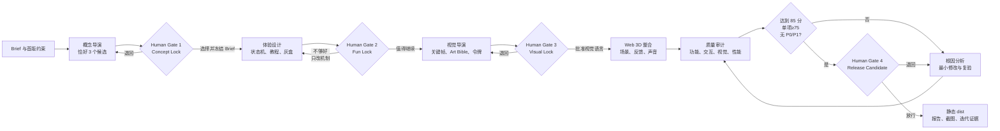
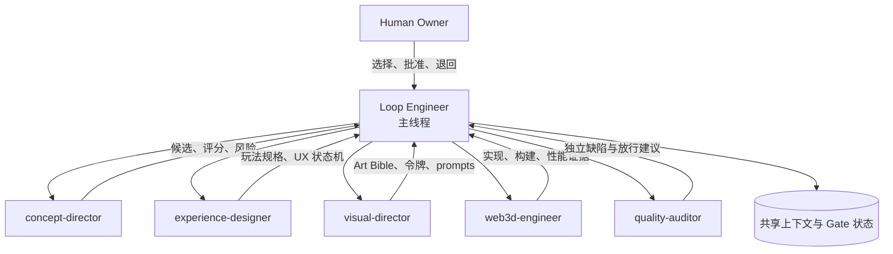
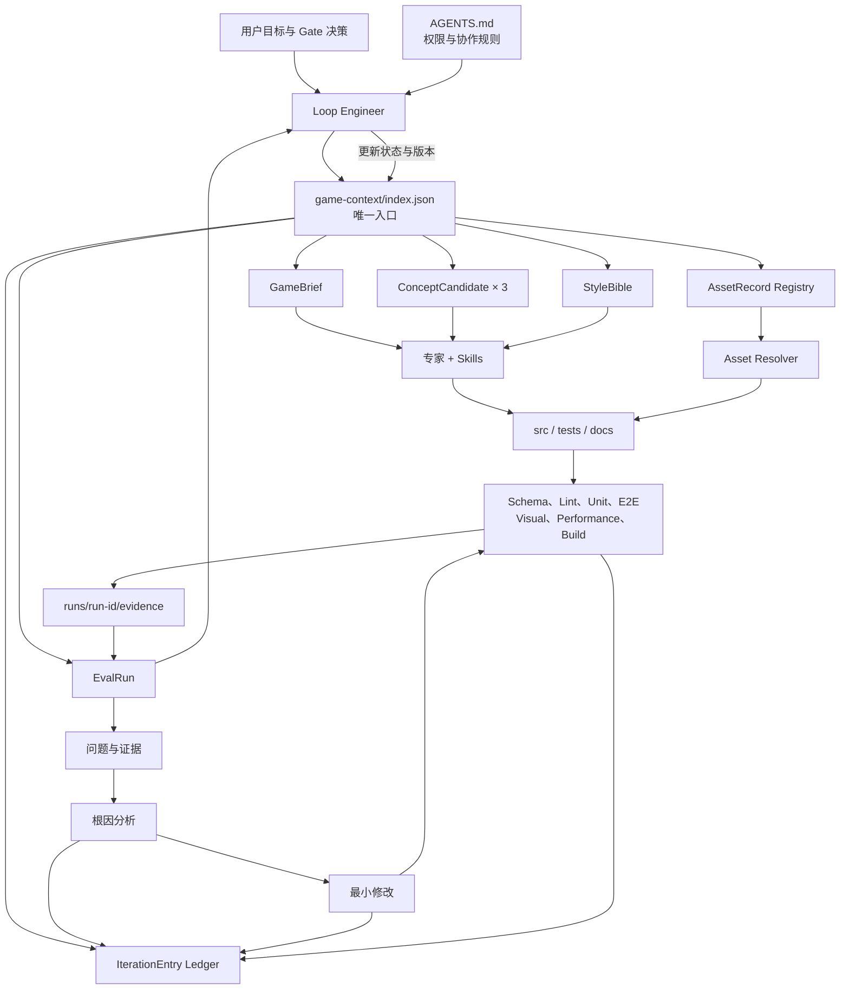
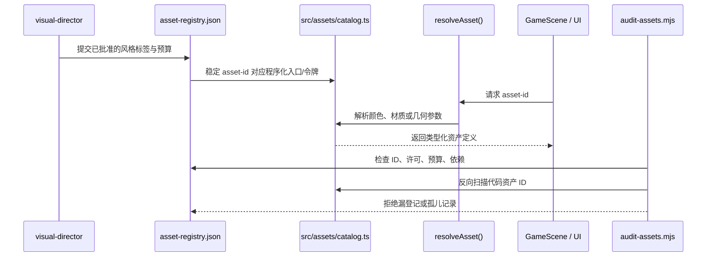
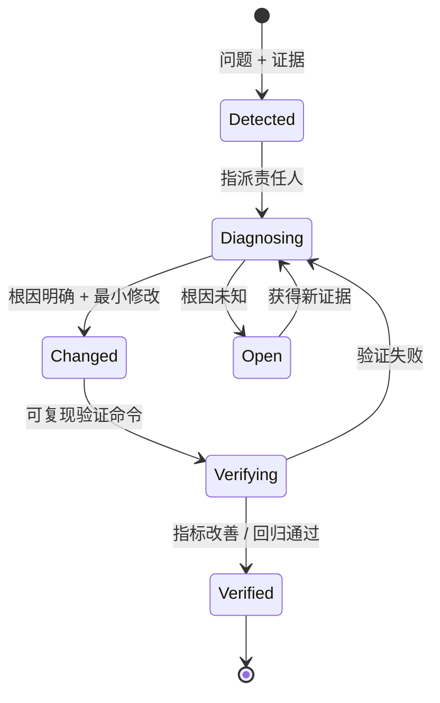

# 架构与工作模式

本文解释 Concept Forge 如何从约束生成概念、经过人工 Gate 逐步变成可发布的 Web 3D 垂直切片，以及文件、数据、专家和验证如何协同。它是理解迭代与纠偏路径的入口；机器可读的实时状态仍以 `game-context/index.json` 为准。

## 1. 核心原则

系统把聊天视为协作界面，而不是事实数据库。Loop Engineer 和所有专家每轮都先读取 `game-context/index.json`，再按其中的 `readOrder` 与 `sources` 获取当前 Brief、概念、视觉规范、资产、评测和迭代记录。

三个约束贯穿所有阶段：

1. **先锁定，再扩展**：主题、玩法、视觉分别通过人工 Gate 后，下一阶段才可开始。
2. **资产通过 ID 流动**：场景只引用稳定资产 ID，由 resolver 解析程序化实现或文件路径。
3. **声明必须有证据**：完成、修复和放行都要绑定命令输出、截图或性能数据，并记录根因。

## 2. 五阶段生产工作流



每次 Gate 都是串行的人类决策点。评分可以缩短判断时间，但不能代替选择。连续两轮修改没有改善时，Loop Engineer 必须回退方案或缩减范围，而不是继续叠加补丁。

当前项目停在生产工作流之前：三个候选作为框架启动证据被保留，但没有 active game，生产开关处于暂停状态。恢复生产前必须先在游戏库建立独立工作区，不能直接把根级启动上下文当成正式游戏继续。

## 3. 角色与写入边界



- **Loop Engineer**：唯一的目标、`run-id`、Gate、共享上下文和迭代账本维护者；负责串行合并跨角色决策。
- **concept-director**：只在 Gate 1 前工作，不得选择自己的方案。
- **experience-designer**：只把已选概念转换为玩法、状态机、教程和信息层级。
- **visual-director**：只定义已选概念的色彩、形状、材质、构图、灯光、UI、动态和英文生成提示词。
- **web3d-engineer**：只实现已批准规格，通过资产 resolver 接入资源。
- **quality-auditor**：独立评测和提出缺陷，不替实现者悄悄修复，也不接受无证据的完成声明。

专家配置在 `.codex/agents/`，技能在 `.agents/skills/`。可以并行的只有不互相依赖的研究、只读审查和测试；共享文件修改、资产 ID 分配、视觉定稿、玩法决策和 Gate 放行必须串行。

## 4. 数据流与反馈闭环



关键点是测试结果不会只留在终端：自动检查的摘要进入 `EvalRun`，原始证据进入当前 `run-id/evidence/`，修复链进入 `IterationEntry`，Gate 决策进入 `run-id/decision/` 与 `run-id/gates/`。下一轮代理从 index 重新读取，因此纠偏不会依赖某段聊天是否仍在上下文中。

## 5. 核心数据契约

| 契约 | 责任 | 主要生产者 | 主要消费者 |
| --- | --- | --- | --- |
| `GameBrief` | 受众、体验承诺、范围、核心动词、成功标准、冻结状态 | Loop Engineer / Human | 所有专家 |
| `ConceptCandidate` | 幻想、循环、操作、视觉钩子、预算、风险、评分 | concept-director | Human / experience-designer |
| `StyleBible` | 色板、形状、材质、构图、灯光、UI、动态、prompts、禁用规则 | visual-director | web3d-engineer / quality-auditor |
| `AssetRecord` | 稳定 ID、定位器、版本、来源、许可、风格、预算、依赖、审批 | web3d-engineer / Loop Engineer | resolver / 资产审计 |
| `EvalRun` | 构建环境、自动检查、分类得分、缺陷、证据、放行结论 | quality-auditor | Loop Engineer / Human |
| `IterationEntry` | 问题、证据、根因、修改、验证、前后结果、状态 | 缺陷所有者 | 所有后续迭代 |

每类数据均有对应 JSON Schema。`scripts/validate-context.mjs` 验证结构和跨文件 Gate 约束，不允许用一份语法正确但相互矛盾的 JSON 冒充有效上下文。

## 6. 资产引用链



文件资产使用仓库相对路径，程序化资产使用 `builtin` 定位器。场景组件不能直接散落文件路径或另造颜色、材质、形状；Gate 3 后如需新增视觉语言，必须先重新审批 Style Bible 和资产记录。

## 7. 文件系统地图

```text
.
├─ AGENTS.md                    # Loop Engineer、专家路由、Gate 与验证规则
├─ README.md                    # 面向使用者的项目介绍和运行方式
├─ CHANGELOG.md                 # 版本、决策、修复与验证摘要
├─ .codex/agents/               # 5 个项目级专家配置
├─ .agents/skills/              # 6 个可复用生产技能
├─ .cursor/rules/               # 始终生效的目录与内容治理规则
├─ games/
│  ├─ registry.json             # 正式游戏清单、active game 与生产暂停开关
│  ├─ README.md                 # 游戏库使用说明
│  ├─ _template/                # 新游戏标准工作区模板
│  └─ <game-id>/                # context/runs/assets/src/tests/docs 全部隔离
├─ game-context/
│  ├─ index.json                # 框架启动夹具的事实源入口
│  ├─ game-brief.json           # 已冻结/待冻结的产品约束
│  ├─ concepts.json             # 三个概念与人工选择
│  ├─ style-bible.json          # 视觉语言；Gate 1 前保持阻塞
│  ├─ asset-registry.json       # 所有资产的稳定 ID 与治理元数据
│  ├─ iterations.json           # 根因修复账本
│  └─ evaluations/current.json  # 当前构建的质量评测
├─ schemas/                     # 所有机器可读契约的 JSON Schema
├─ runs/<run-id>/               # 框架启动验证历史；正式游戏使用 games/<id>/runs
│  ├─ input/                    # 本轮输入快照
│  ├─ output/                   # 专家输出快照
│  ├─ decision/                 # 人工决策
│  ├─ gates/                    # Gate 状态
│  └─ evidence/                 # 截图、测试输出、性能数据和报告
├─ src/
│  ├─ assets/catalog.ts         # 类型化资产目录与 resolver
│  ├─ game/model.ts             # 与渲染分离的纯 TypeScript 状态机
│  ├─ game/useGameControls.ts   # 输入到状态机事件的适配层
│  ├─ game/GameScene.tsx        # React Three Fiber 渲染层
│  └─ App.tsx / styles.css      # React DOM UI 与语义设计令牌
├─ tests/e2e/                   # 功能、视觉、性能浏览器测试及基线
├─ scripts/                     # 上下文、资产、技能和质量报告校验
├─ docs/                        # 架构、治理和质量说明
└─ dist/                        # Gate 4 后交付的静态构建，不纳入 Git
```

`Note.docx` 是仓库原有用户文件，不进入生产上下文，也不会被自动提交。

未来具体游戏不得继续向根级 `game-context/`、`runs/` 或 `src/game/` 混入内容。根级现有内容是可测试的框架夹具；正式内容必须由 `games/registry.json` 注册并进入 `games/<game-id>/`。详细规则见 `docs/content-governance.md`。

## 8. 一轮迭代如何被追踪



每次修改至少更新两层记录：

1. `CHANGELOG.md` 记录对使用者和维护者可见的变化与关键决策。
2. `game-context/iterations.json` 记录可机器审计的缺陷链，包括验证前后数据。

如果某次工作会改变 Gate 或正式范围，还要同步更新 `game-context/index.json`、当前 run 的决策与 Gate 文件。所有更新在同一轮验证后提交，避免文档状态领先于真实构建。

## 9. 统一命令与放行顺序

```bash
npm run validate:context   # Schema、索引、Gate 跨文件一致性
npm run validate:library   # 游戏注册、目录隔离、active game 与 manifest
npm run audit:assets       # 资产元数据与代码引用双向审计
npm run validate:skills    # 技能元数据、引用、样例与失败路径
npm run lint               # 静态代码检查
npm run test               # 状态机单元测试
npm run build              # TypeScript 与生产构建
npm run test:e2e           # Chrome 用户路径与 1080p 布局
npm run test:visual        # 固定种子/相机/时刻的视觉回归
npm run test:performance   # 60 秒目标路径与真实 renderer 记录
npm run quality            # 完整检查 + Gate 4 正式质量报告
```

实际放行顺序是：先运行框架校验，再运行浏览器检查，最后让 `quality-report` 读取当前 `EvalRun`。即使代码和浏览器测试通过，只要人工 Gate 未完成或质量分不足，完整质量命令仍应失败。

## 10. Git 与发布模型

每个 Gate 形成一个可回退提交，Gate 4 通过后为 Release Candidate 打版本标签。GitHub 仓库默认创建为私有；首次发布只推送源码、上下文、基线和证据，不公开部署。`dist/`、测试临时报告、依赖目录以及 `Note.docx` 不进入版本管理。
