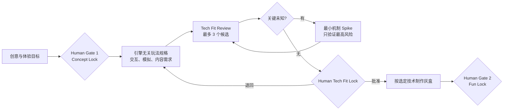

# 技术选择治理

本系统不把技术栈当成创意生成的前提。技术决策的职责是忠实实现已锁定的体验，而不是让策划适应某个熟悉框架。

## 决策时点

Concept Lock 前允许讨论技术风险，但不能锁定引擎、平台、输入、渲染维度或资产管线。体验设计先产出引擎无关的玩法状态、互动意图和能力要求，之后技术比较才有可信依据。

## 需求维度

Tech Fit Review 至少判断：

- 体验：2D/2.5D/3D/XR、镜头、输入、反馈时延和可访问性。
- 模拟：物理精度、角色数量、确定性、寻路、联网、持久化和运行时 AI。
- 内容：场景规模、动画、材质、音频、叙事工具、生成资产与人工编辑链。
- 交付：目标设备、安装/浏览器、包体、启动时间、离线、平台审核和分发。
- 生产：团队与 AI 可实现性、调试工具、自动测试、构建速度、许可证和维护成本。
- 风险：不可逆投入、供应商锁定、性能上限、关键插件依赖和迁移边界。

权重必须来自当前游戏，不能沿用全局固定权重。例如，强物理玩法可提高模拟正确性的权重；叙事驱动原型可提高内容迭代与本地化工具的权重。

## 候选与 Spike

每轮最多比较三个真正可行的路线，避免把方案数量当成严谨。候选可以来自 Web 框架、通用游戏引擎、轻量 2D 工具、原生渲染或其他组合，但只有满足硬需求的方案才能进入比较。

当证据不足时，Spike 只实现会改变技术结论的最高风险机制，例如大规模单位更新、可破坏物理、低延迟联网、特殊着色或目标设备输入。装饰性场景、菜单和通用移动不能替代风险验证。

## 机器契约

每个游戏在 `games/<game-id>/context/technology-decision.json` 记录：

- 硬需求、偏好和未知项。
- 不超过三个候选、权重、证据、风险和淘汰原因。
- Spike 的假设、预算、复现步骤和结果。
- 推荐方案、拒绝方案和迁移边界。
- 人工批准、锁定状态和该技术自己的 dev/build/test/quality 命令。

游戏进入 `graybox`、`visual`、`integrated` 或 `released` 状态前，`validate:library` 会检查技术决策是否存在、位于本游戏目录、已由人类批准且状态为 locked。

## 当前 Web 3D 代码的地位

根目录现有 Vite/React/Three.js 应用属于框架验证夹具。它证明静态 Web 3D 是一个可用候选，并提供资产 resolver、确定性视觉测试和性能证据，但不构成任何未来游戏的默认架构。只有某个游戏的需求与证据再次选择它时，才允许复用。
