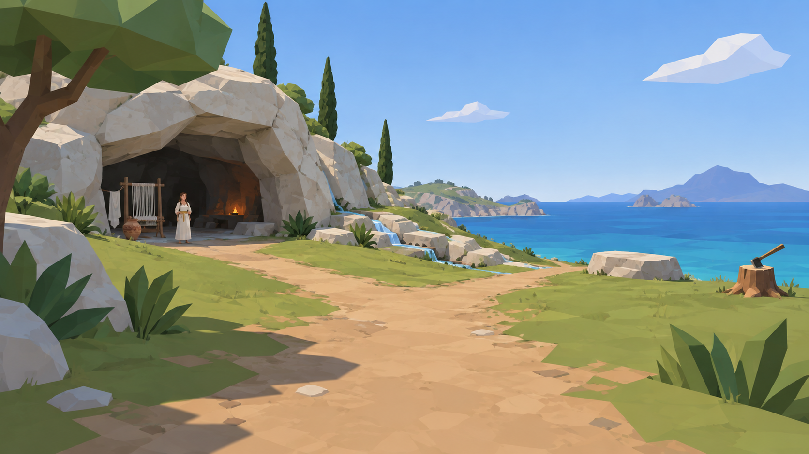

# 卡吕普索 · 开放草地与无法替代的家

设计候选 R1 · 现已按用户后续指令进入代码实施，见 [实现交接](CALYPSO_IMPLEMENTATION.md)。本文件保留当时的设计目标，不代表每项都已通过审美验收，不构成 Visual Lock。

Run：`run-20260909-calypso-design-r1`。本轮仅修订环境与资产设计，不改游戏、对白、材质、资产工厂或工作台。

## 1. 参考图的采用边界

采用：平视步行尺度、开阔草地、左侧洞居与右侧海面、稀疏且轮廓清楚的植被、大块多边形受光面。

不照搬：单条层叠瀑布、泛化洞口、随机散石、只能远看的人物。图负责视觉方向，不证明地形、水路和交互可行。

反驳：变空不自动等于减法设计。该删的是重复信息，不能删掉身份和生活证据。借鉴上田文人的减法设计视角，集中打磨少数重要对象，不复制其作品外观。[方法来源：David Sirlin 对 Ueda 讲演的记录](https://www.sirlin.net/articles/subtractive-design)。

本幕命题：**自然始终丰盛，生活始终受到照料；只有面朝海的人想离开。** 软禁通过去不了的远方表达，不增加锁链、牢房，也不把卡吕普索设计成恐怖反派。

## 2. 现状证据 → 最小设计改变

- `src/game/scenes/calypso.ts`：洞居背景主要由三块纵向放大的岩石构成；NPC、织机、成衣都在 `z=-19`。改为连续洞壳和有前后关系的生活位置，消除展品排列感。
- 同文件有 44 次散石布置。删无功能散布，保留承担岸缘、遮根和地形转折的岩组，不只是换一个随机数量。
- `src/world/late-effects.ts`：四路各 28 段、每段两块岸石，共 224 块；四臂等长、近似正交，末端未延展到本幕外岸。改为顺坡、长短不同、各自接海的水路。是否存在逆坡须灰盒实测，不能仅由代码推断已发生。
- `src/world/late-assets.ts`：通用发型没有指定的焦糖色肩前麻花辫，袖部与披布也不等同于无袖低领长裙。只重塑卡吕普索，不连带改喀耳刻。
- 当前已有 20 树桩含斧座、5 线索、1 NPC、1 回忆与 1 离岛点。保留契约，不新增收集或强制任务。

判断（中置信）：主要短板是空间组织和身份造型，而非贴图分辨率。是否更有感染力仍需同眼位实景检视。

## 3. ABC 是相连生活空间，不是三个独立景点

### A · 洞居：被照料的生活

左侧中景，以横向岩檐压出可进入空间。整体岩壳约 12 × 8 × 6 m；洞口宽约 8 m、最高净空约 4.5 m。三个主折面加两处明显负形，不是三根石柱或贴在山上的黑洞。外亮内暗，人物站在光线过渡带。

前缘是卡吕普索和织机，后侧是低火塘、坐席与收纳凹位。成衣在侧壁木钉上，与织机错位：一次转头读到“还在织”与“织完却没穿”。洞底不扩成地下城。

只保留住区磨光面、火塘烟熏和折叠坐席。生活痕迹不擅自追加“曾经恩爱”或“她很邪恶”等对白没有确认的情节。

### B · 四泉草地：不会耗尽的丰盛

中部是低草和四路水，不是瀑布花园。岩缝供水汇入浅池，从四个开口分流，沿实际坡度分别到四处海岸。每路保留连续水面和清楚的岸缘，取消逐段等距石珠。

水宽约 0.45–0.8 m、浅水目标深 0.08–0.15 m；这些是待制作参数，非当前运行时水深。与路相交处做平缓涉水面，无需跳跃。四路可分两次观察读全，不强求入口同屏展示，也不能拿一条瀑布替代。

植被只集中泉边和岩脚，步行中心留空；水路的起点、转折和入海出口都必须能追踪。

### C · 面海凹岩与伐木地：离开的方向

右侧保持干净海平线。一块向海倾斜的低岩台，以真实凹陷坐面替代普通扁石；坐面磨亮、外缘粗糙。一条重复经过的地表磨损带足够，不加七道刻痕字面解释七年。

20 树桩分为 6、7、7 三组砍伐斑块，最后一组包含斧座。近看能数清，不排方格，也不在 20 个装饰桩外再加斧座。斧—树桩空缺—海形成视线，船仍在登岸区。

不突然变灰黑死地：仍是同一阳光和自然，磨损只集中在人做出选择的位置。

## 4. 第一人称布局与检视镜头

以下坐标为灰盒候选，单位米，沿现有 X/Z；Y 必须按新地形支撑面求解，不能复制旧高台 Y=4.2。

- 保持登岸 `(4,33)`、船/离岛 `(6,36)`、约 40 m 半径单岛。“开放世界感”指视野和自由探索，不扩成无缝大地图。
- A 洞壳中心 `(-12,-13)`；NPC `(-7,-9)`；织机 `(-14,-9)` 斜朝开阔处约 25°；成衣 `(-17,-13)` 靠侧壁，离火塘至少 2 m。
- B 泉源 `(-12,3)`；四路方向朝西、北、西南、东，终点按实际地形/海面交线求解，不以固定半径冒充岸线。
- C 凹岩 `(24,14)`；树桩组中心 `(10,-5)`、`(18,-11)`、`(8,-17)`；斧座保持 `(10,-19)`。
- 主行走带宽 2.4–3.2 m，支线净宽至少 1.5 m。目标坡度 ≤8°、衔接台阶 ≤0.12 m；需在当前控制器中验证，不是已测通行保证。

不强制 A→B→C；5 线索可选，回忆仍是离岛唯一叙事门槛。水、岩石和树不能封死绕行。

四个固定检视机位：

1. V0 登岸 `(4,33)`：洞左海右，先读地标，不要求看清辫子与纹样。
2. V1 清地 `(0,4)`：三个区域同属一处空间；NPC 距约 15 m，辨认完整人形、衣色、站姿，不被横杆切断。
3. V2 生活 `(-5,-6.5)`：在现有对话范围内，头、肩、腰带、肩前辫可读；不强制拉镜头，也不要求近距离仍把全身压成小画面。
4. V3 望海 `(21,14)`：凹陷、海与来路同在，前景不塞巨罐和遮眼树叶。

统一眼高 1.68 m / 默认 FOV 62°，补测设置端点 50°、80°。不为模仿参考图广角而修改全游戏 FOV。无手臂、武器、第三人称背影，不加自动运镜。

回忆沿用 66 秒文本与眼位锚定，斧周围留开阔区；验证完整序列主体不裁切，不只截第一帧，不把巨大记忆平面贴到洞口。

## 5. 资产组一：环境骨架与自然

新 ID 均为候选，未分配进正式注册表；已有 ID 只提出修订，不提前递增已实现版本。以下预算为制作目标，非测量结果。

**洞居岩壳｜新建 1 套。** 候选 `game.nostos.environment.calypso_cave`。外壳、内壁、顶檐、平台与简单碰撞可分别检查，总目标 ≤8k 渲染顶点。大折面加少量侵蚀缺口，无密集细分噪声；内部有真实深度、完整顶面和支撑面。沿用暖灰岩石与三段明暗，檐底冷灰，局部烟熏；不靠整屏过曝造神性。

**四泉水网｜新建本幕布局，复用机制。** 候选 `game.nostos.environment.calypso_four_rills`。复用 `game.nostos.vfx.late_scene_effects` 的更新/暂停/减少动态/释放，不破坏伊萨卡烟火。四路各有源点、控制点和岸线终点；沿程水面不得逆升，出口不悬空。水与岸总目标 ≤6k 顶点；岸用连续条带，少量拐点才摆独立岩石。高光稀疏，不铺满泡沫粒子。

**活树｜4–6 株、2 变体。** 候选 `game.nostos.environment.calypso_cedar`，每株目标 ≤1.2k 顶点。横向分层大树冠、低枝留空，不将现有 `cypress()` 只改名为雪松。20 株被伐雪松是本作改编，不声称原典限定树种。

**低植被｜复用重组。** `game.nostos.environment.coastal_leaves`，先摆 8–12 簇叶丛，花最多 3 簇；概括叶片而非毛茸茸草毯。背景至少一半地表不放植被散件，是起始布景约束，不冒充自动统计。

**次级岩组｜复用减量。** `game.nostos.environment.sea_rock`，6–8 组、每组 1–3 块，分别承担岸缘/遮根/转折。线索周围和水面无随机散石；洞壳、凹岩另计，不混入散布池。

## 6. 资产组二：七年与离开的证据

**凹陷石座｜新建 1 件。** 候选 `game.nostos.prop.calypso_seat_rock`，目标 ≤2k 顶点；坐面约 0.75 m 宽，以几何形成凹陷，磨光区与外缘对比。沿用 `calypso.hollow` 的看/触交互，不新增坐下动作。

**树桩｜修订 20 件、3 变体。** `game.nostos.prop.cedar_stump`，直径约 0.6–0.95 m、高 0.35–0.65 m，每件 ≤500 顶点。斜切、粗年轮和少量纤维缺口，不重复同一裂口朝向。20 个逻辑实例与渲染实例一一对应，斧座包含其中。

**斧｜新建英雄资产 1 件。** 候选 `game.nostos.prop.calypso_axe`，目标 ≤1.5k 顶点；柄约 0.8 m、握区磨亮、刃口缺损、刃身大平面。复用 `game.nostos.texture.wood_grain` 局部顺纹；不以密纹代替形体，不额外生成第 21 个树桩。

**织机｜保留结构、修改摆位。** `game.nostos.prop.weighted_loom`。保留经线、配重、综杆和承重支架，调整本幕半织布与朝向，不退回白帆架。脚底逐点接地，观看区不与 NPC 抢焦点；共享结构若有修改必须回归喀耳刻。

**未穿成衣｜修订挂法 1 件。** `game.nostos.prop.unworn_robe`。由展架语境改为侧壁两点悬挂，领/袖负形清楚。它是给奥德修斯的衣服，不是卡吕普索长裙复制品；不破、不脏、不打补丁，强调保管却未使用。保持既有工厂/工作台接口兼容。

## 7. 资产组三：卡吕普索与少量生活物

**卡吕普索｜专属重塑 1 人。** `game.nostos.character.calypso`，目标 ≤12k 渲染顶点，低于既有 20k 上限。低模不等于将脸简化成路边石块。

- 成年女性，沿用约 1.9 m 尺度；头颈肩与双臂负形清楚，微偏重心，手自然停身前或织机旁，不是僵直 T 形。
- 焦糖色头发在后脑束起，一条粗麻花辫从肩上垂到胸前；用 6–8 组交错体块，不用两根背后细管，不逐根发丝。焦糖色从既有赭石/陶色家族取样，色片待人工批准。
- 希腊式无袖连衣长裙、低而克制的领口、金色腰带；腰下 6–8 道主折，肩部有固定结构，取消遮住肩臂与腰线的大披布。
- 暖骨色裙身、冷灰暗部；金属腰带以既有金赭色和亮暗边表达，不换写实镜面金。脸有眼窝、鼻梁、嘴、耳，手有指组；避免黑眼洞和锐利三角噪声。
- 神态克制清醒，不媚笑、不怨毒。静态姿态是本轮定义范围；呼吸、转头须另验实现能力，不承诺现有通用模型已有骨骼或织布动画。

服装借鉴矩形布料固定与束腰结构；具体低领、发色、辫型是用户艺术设定，不是考古结论。[Met 服装结构参考](https://www.metmuseum.org/essays/ancient-greek-dress)。

**生活小组｜四类，不扩成杂物市集。** 候选 `game.nostos.prop.calypso_domestic_set`：1 低火塘、1 折叠坐席、2 陶器、1 小组纺织工具，总目标 ≤3k 顶点，不新增交互点。火塘离挂衣 ≥2 m；陶器一高一低，实际表面净距 ≥0.2 m，不叠穿、不堵路。

陶器先做口沿厚度与把手负形，腹部仅一圈稀疏叶枝和水平边带。复用 `game.nostos.texture.pottery_paint` 与 `game.nostos.material.painted_clay`，不全器包花、不复制馆藏整图。纹样识别生活用途，不变成新神话插画。

磨损分配：木柄/织机有触摸磨损，陶口轻磕，火塘烟熏，未穿衣无磨损。禁止所有资产统一套脏污贴图。

## 8. 材质、颜色与复杂度边界

继承 StyleBible v7 的 3D polygon、三段非 PBR 明暗、海蚀彩陶色族，不改全游戏 StyleBible。60 安静大面 / 30 结构 / 10 叙事细节作为构图方法，不冒充 GPU 指标。

草地橄榄绿、海蓝绿、岩暖灰、布暖骨、陶红褐；先读明朗自然，不能全景黄雾。洞内冷暗和局部火色建立深度。具体曝光须引擎对照测试，不从生成图反推出参数。

允许局部木纹/陶纹；不新增 4K PBR、密草卡、照片岩纹、噪声法线和全表面刻花。材质身份先靠形体、色块与有位置依据的磨损。

总预算沿用既有 ≤300k 渲染顶点、≤250 draw calls，朝 80 calls 目标优化；英雄资产不破 ≤20k 顶点。全部为制作约束，不是已测性能；完成后核验实际 BufferGeometry 和 renderer 统计。

## 9. 实施顺序、失败信号与交接

**P0 空间灰盒**：洞壳、可走地形、泉槽、物件占位、V0–V3。失败：入口不清、NPC 被挡、涉水需跳、四泉逆坡/悬空、海只剩小缝。先通过空间再做精模。

**P1 人物与居住关系**：先看人物正/侧/背及对话视角，再看织机/成衣/洞居合景。失败：肩前辫不读、无袖被披布遮住、成衣仍像商店展架、工作台美但实景不可读。

**P2 英雄线索与自然收束**：凹岩、20 树桩、斧、少量植物。又变杂时先删非线索装饰，不牺牲人物和英雄物件信息。

**P3 联动验证**：游戏/工作台共用 ID；5 clue / 1 talk / 1 memory / 1 depart 不变；20 树桩含斧座；4 水路各接海；66 秒回忆全过程可读。检查暂停、减少动态、离岛门槛，以及共享织机/特效的其他幕回归，再收集实际性能数据。

人工审美通过前，不开始正式资产生产或合并 main。本轮验证文档、引用与契约一致性，不宣称游戏已按图改好。

关键未知：约 40 m 半径能否同时容纳四路入海水、三个区域和自然缓坡。灰盒若失败，先缩洞深、合并装饰区域，不放大岛、不加跳跃、不偷换成一泉。

机器可读交接见 [asset-plan.json](../runs/run-20260909-calypso-design-r1/asset-plan.json)。候选 ID 未注册；参考图仅为 run 输入，不是可发布资产。

复用经验：**先看人在哪里、路通哪里，再看大轮廓与材质，最后看微细节。** 走近应获得新的叙事信息，而非更密的噪声。
